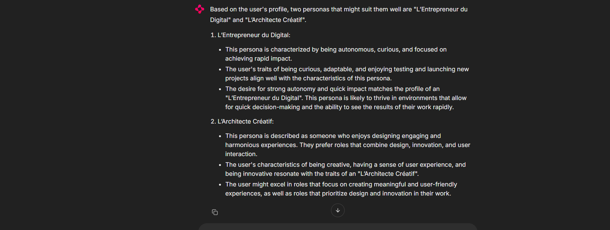
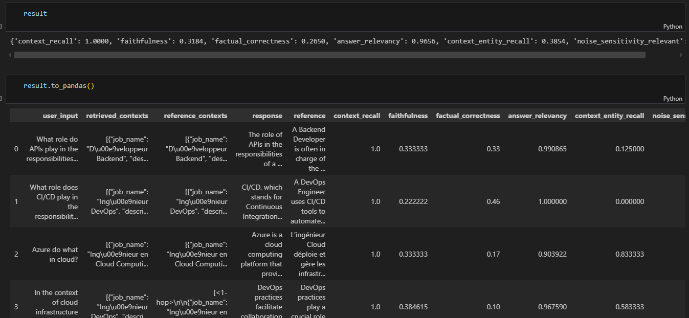
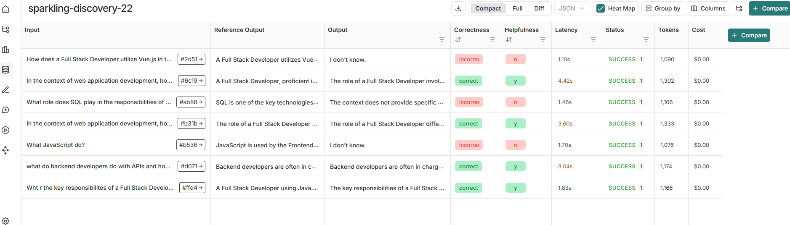

# Task 1: Defining your Problem and Audience

#Task 1: Articulate the problem and the user of your application

This app is for for people transitioning to IT careers it can be challenging to find the most suitable role. 
People that want to transition to tech can lose lot of time to find advice and rodmaps.
Also They don't know about the challenges and characteristics they need to succeed in their new career or even how based on their previous experiences, they could be a great fit for a particular role.

Transitioning is also not just about the new job. It's also about finances. Free Curated courses, bootcamps, coaching and government help are available but people are not aware of.

# Task 2: Propose a Solution

Career counselor is a chatbot that  will ask the user some information about his personality, what he is looking for, his knwoledge and experience. Based on that information, the chatbot will give him recommendations about an IT role that could suit him and guidance on how to make the transition.
I'm going to use 

    1. LLM
    2. Embedding Model
    3. Orchestration
    4. Vector Database
    5. Monitoring
    6. Evaluation
    7. User Interface

Tools:
    - Tavily search : To make searches regarding courses, bootcamp and government programs

# Task 3: Dealing with the Data

The app will embed resumes and compare the resumes embeddings to job careers. Also the app will use external embedded document like job descriptions and personas 

Chunking startegy : I use PyMuPDFLoader document loader that uses resursive RecursiveCharacterTextSplitter by default. It is useful because it can chunk logically by sentences and paragraphs. which is generally how resumes content is. Next i could also add semantic chunking to keep meaning of the sections

# Task 4: Building a Quick End-to-End Prototype

<aside>
📝

Task 4: Build an end-to-end RAG application using an industry-standard open-source stack and your choice of commercial off-the-shelf models

https://github.com/gtossou/aie5-midterm/blob/main/app.py

# Task 5: Creating a Golden Test Data Set

Link to ragas evaluation
https://github.com/gtossou/aie5-midterm/blob/main/ragas_evaluation.ipynb

My experiments give good results. The collection doenst contains documents that are linked one to another. We are talking about job descriptions. Thats why w helpfulness is not good for a certain typ of questions.
ut for the questions that requires to dscribe jobs, we have good answers

# Task 6: Fine-Tuning Open-Source Embeddings

Notebook for fine tuning : https://github.com/gtossou/aie5-midterm/blob/main/embedding_fine_tune.ipynb

Model uploaded to hugging face : https://huggingface.co/koffiwind/jobs_model/tree/main

# LOOM VIDEO

https://www.loom.com/share/822e744bae724f2ca0a09d6dea4e0b94?sid=dad7fc39-1d86-4b19-965c-a04e262454f0